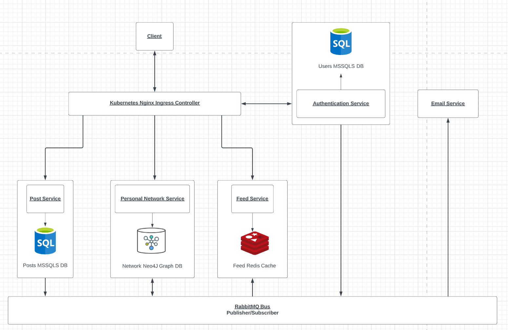

# Social-Media
I developed an interest in microservices and distributed systems, and believed building a social media backend api may be a good start. 
## Architecture

### Languages/Framework
* ASP.NET Core (C#)
### DevOps
* Docker used for containerization
* Kubernetes used for orchestration
* Github actions used for building each Docker container and deploying it to Docker Hub
* Nginx Ingress Controller for loadbalancing. Allows for traffic to be directed to appropriate services and ingress level authentication.
### Messaging
* RabbitMQ, using the direct Publisher/Consumer model. Each service/need will have its own queue. 
* Will explore GRPC in the future
### Database
* Microsoft SQL Server for keeping track of users, posts
* Neo4j Graph Database for keeping track of connections amongst users
* Redis for caching follower/following lists, posts, home feeds and user feeds
### Microservices
* Authentication Service
  * Handles logins, registration and authentication
  * Passwords are hashed using Bcrypt and JWT is utilized to authenticate the user
* Email Service
  * Consumes bus and email sent out on registration for user awareness
  * MailTrap is used for development email testing
* Personal Network Service
  * Handles the follower and following interactions between users 
  * Consumes message bus and a user node is created in the graph on regisration
* Post Service
  * Handles users creating posts 
* Feed Service
  * Generates the user and home feeds
  * Consumes message bus and on every post, it is pushed to all follower's feeds
  * Consumes message bus and on every follow/unfollow, the list is stored in the cache and is rebuilt to reflect the change
### To Explore in The Future
* Redis 
  * Failover
  * Timed expiration of cache (Remove frome cache if user has not logged in for eg. 30 days)
* OAuth
* Kafka
* GRPC to fetch followers and posts when not in cache
* Cassandra Database
* Vault/Secret Management
* Distributed Logging (eg. Elastic)

